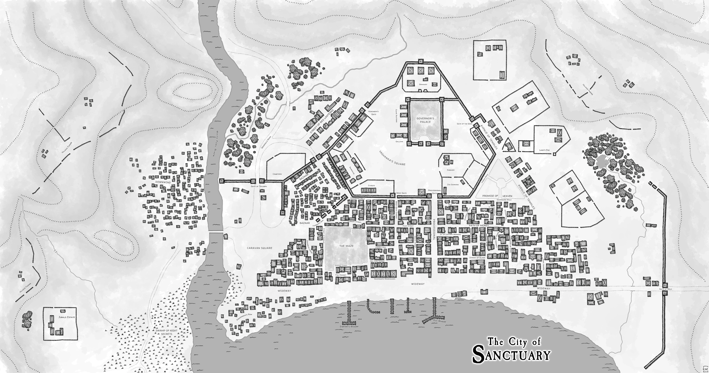

# Map of the City of Sanctuary (Thieves' World)

This is a map of the city of Sanctuary that I made made with Wonderdraft and hand-drawn assets. Sanctuary is a City in the shared world nocel setting of [Thieves' World](https://en.wikipedia.org/wiki/Thieves%27_World) created by by Robert Lynn Asprin in 1978.

This map is heavily inspired by the map included in the [Thieves' World RPG supplement](https://en.wikipedia.org/wiki/Thieves%27_World_(role-playing_game)) published by Chaosium in 1981.

My map of Sanctuary is licensed CC BY-SA 4.0 (https://creativecommons.org/licenses/by/4.0/)

(c) 2023 by Thomas Seliger (neovatar)

